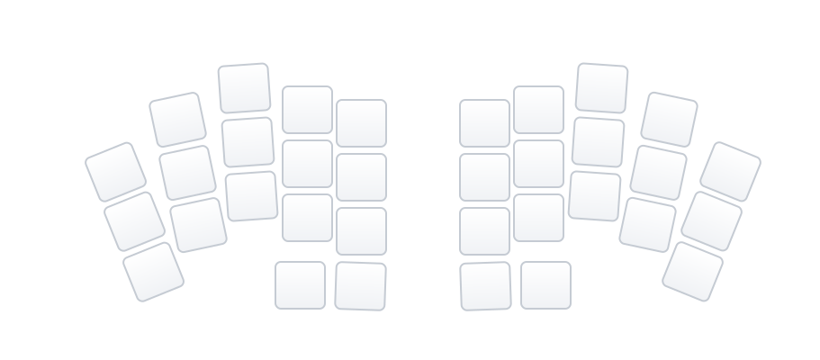

## Delta Lambda

A low-profile, wireless split keyboard variant.

- **Base Design:** Inspired by [unspecworks/delta-omega](https://github.com/unspecworks/delta-omega)
- **Layout:** 34 keys (3x5+2) with ergonomic splay
- **Switches:** Kailh Choc v1 / v2 (Hotswap)
- **Controller:** Seeed Studio XIAO nRF52840
- **Firmware:** ZMK (Wireless BLE)

### Layout



### Layers

| Layer | Description |
|-------|-------------|
| BASE  | Gallium alpha layout with GACS home row mods |
| NAV   | Navigation, arrows, editing |
| NUM   | Number pad + arithmetic |
| FUN   | Function keys, media controls |
| UTIL  | Bluetooth, mouse keys |
| GAME  | Gaming layout (toggle) |

### Building

Firmware is built automatically via GitHub Actions on push.

To generate layer SVG diagrams locally:

```sh
python tools/gen_svg_layers.py
```
